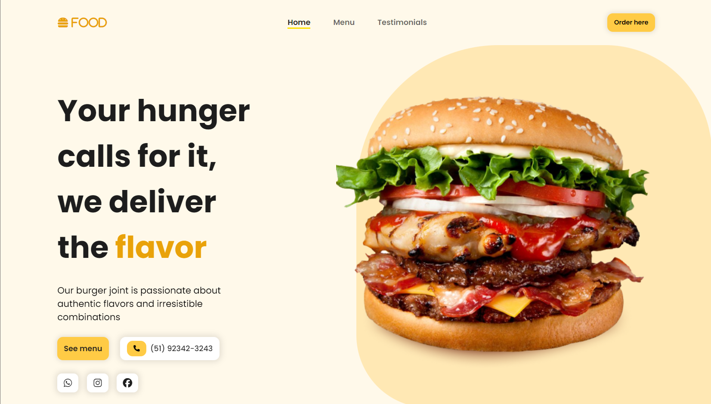

# Responsive burger shop page
### Food Pages 1 🍔

- Responsive burger shop website using HTML, CSS and JavaScript (JQuery)
- Contains animations when scrolling.
- Based on orange tones.
- Smooth scrolling in each section.
- Developed first with the Mobile First methodology, then for desktop.
- Compatible with all mobile devices.

This page is part of the series of pages about food that I will develop, keep an eye out!

